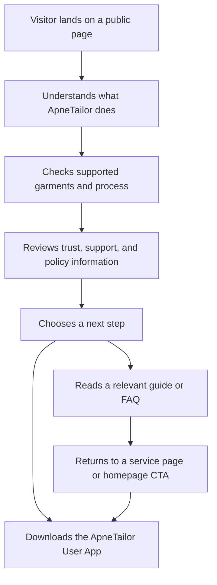

# ApneTailor Website PRD

## 1. Product Overview
ApneTailor needs a production-grade public website that explains the service clearly, builds trust without fabricated social proof, and converts relevant visitors into user-app downloads. The website must work as a long-term business asset for discoverability, editorial growth, and public credibility.

- Primary purpose: explain what ApneTailor does, how it works, and why it is trustworthy
- Primary conversion: drive downloads of the ApneTailor User App through a centralized CTA configuration
- Target users: people in India looking for convenient custom stitching, garment-specific tailoring help, pickup and delivery convenience, and better visibility into the tailoring process
- Market value: create a fast, premium, searchable, AI-readable, content-driven web presence that can scale with the business

## 2. Core Features

### 2.1 User Roles
| Role | Access Method | Core Needs |
|------|---------------|------------|
| Customer / Visitor | Public website | Understand the service, supported garments, process, trust factors, policies, and next step |
| Content Editor | Repository updates | Add and edit structured content, FAQs, services, and articles without a CMS |

### 2.2 Feature Modules
1. **Homepage**: value proposition, trust framework, process summary, supported garments, primary CTA
2. **How It Works**: high-level customer journey, two fabric flows, tracking and support explanation
3. **Services Hub**: supported garments overview, women’s hub, men’s hub, garment-specific entry points
4. **Garment Pages**: unique pages for approved supported garments only
5. **Trust And Policy Surface**: support, accessibility, security, editorial standards, review standards, legal pages
6. **FAQ Hub**: centralized customer-question system grouped by topic
7. **Editorial System**: blog hub, article pages, author/editorial page, internal linking
8. **Contact And Support**: clear support route using the public support email
9. **SEO And Discovery Layer**: metadata, structured data, sitemap, robots, canonical logic, machine-readable outputs where justified

### 2.3 Page Details
| Page Name | Module Name | Feature Description |
|-----------|-------------|---------------------|
| Homepage | Hero | Explain ApneTailor in one glance, show primary CTA, avoid generic startup clichés |
| Homepage | Process Snapshot | Summarize how garment selection, measurements, tailoring details, fabric flow, tracking, and delivery work |
| Homepage | Trust Surface | Use process-based trust, founder identity, support contact, policy links, and product-evidence placeholders |
| Homepage | Supported Garments | Show currently supported categories only, grouped by women and men |
| Homepage | FAQ Preview | Surface the highest-friction customer questions |
| How It Works | Workflow Narrative | Explain the customer journey without revealing confidential internal logic |
| How It Works | Fabric Flow Split | Clarify customer-provides-fabric vs tailor-provides-fabric paths |
| Services Hub | Category Overview | Introduce women’s and men’s garment hubs with clear wayfinding |
| Women’s Hub | Garment Cards | Link only to supported women’s garment pages |
| Men’s Hub | Garment Cards | Link only to supported men’s garment pages |
| Garment Page | Preparation Guidance | Explain what users should prepare, measurement and fabric considerations, and how ApneTailor fits the garment type |
| About | Company Story | Explain why ApneTailor exists, the customer problem, and the public founders without inventing biographies |
| Contact | Support Route | Provide clear contact guidance centered on `support@apnetailor.com` |
| Support | Help Surface | Organize support topics, complaint guidance, policy links, and app-related help routes |
| FAQ Hub | Topic Clusters | Group FAQs by process, garments, measurements, fabric, delivery, payments, privacy, and support |
| Blog Hub | Editorial Index | List high-quality question-led content with filters or topic groupings if justified |
| Article Page | Direct-Answer Format | Lead with a direct answer, provide practical explanation, relevant FAQs, TL;DR, and contextual CTA |
| Editorial Team | Authorship Transparency | Explain what “ApneTailor Editorial Team” means without inventing people |
| Security | Trust And Safety | Explain the security-conscious posture at a high level without unsupported promises |
| Media | Press Information | Provide company description, founder names, approved brand information, and media contact route |
| Legal Pages | Readable Layout | Preserve existing legal meaning and routes while integrating into the design system |

## 3. Core Process
Main user flow:
- A visitor lands on the homepage or a garment/article page
- The visitor quickly understands what ApneTailor is and whether it matches their need
- The visitor explores how the process works, which garments are supported, and what happens with measurements, fabric, pickup, progress updates, and delivery
- The visitor reviews trust surfaces, support routes, and policy information
- The visitor clicks the app-download CTA or continues through educational content before converting

## 4. User Interface Design

### 4.1 Design Style
- Primary colors: dark blue and white
- Supporting palette: restrained neutrals with limited premium accents for hierarchy and interaction
- Typography: distinctive, premium, editorial-feeling type pairing with strong readability
- Layout: mobile-first, content-led, generous spacing, custom composition, and strong section rhythm
- Motion: subtle custom reveals, marquee or thread-like movement where justified, no loading screen, no repetitive fade-up animation
- Component feel: refined, trustworthy, tactile, and original rather than trendy SaaS

### 4.2 Page Design Overview
| Page Name | Module Name | UI Elements |
|-----------|-------------|-------------|
| Homepage | Hero | Strong typography, immediate message clarity, premium CTA treatment, restrained motion |
| Homepage | Process Snapshot | Timeline or flow storytelling with clear hierarchy and mobile-first layout |
| Homepage | Trust Surface | Dense but readable trust blocks, identity cues, policy shortcuts, product-evidence framing |
| Services Hub | Category Overview | Structured navigation, garment grouping, and clean scannability |
| Garment Page | Preparation Guidance | Content-led layout with checklists, support links, and contextual CTA |
| How It Works | Workflow Narrative | Storytelling sections with visual rhythm and lightweight enhancement |
| Blog Hub | Content Index | Editorial grid/list hybrid with metadata clarity and topic grouping |
| Article Page | Reading Experience | Narrow readable text column, strong heading system, FAQ and TL;DR sections |
| Legal Pages | Long-Form Readability | Comfortable line length, sticky section navigation if lightweight, strong typography |

### 4.3 Responsiveness
- Build mobile first and scale upward
- Optimize for common Android and iPhone widths first
- Avoid horizontal overflow, clipped marquees, oversized headings, and hover-only interactions
- Keep navigation, CTA access, and legal readability strong on small screens
- Respect `prefers-reduced-motion` and provide touch-friendly fallbacks

## 5. Functional Scope

### In Scope For V1
- Static-first public website
- Core marketing, trust, support, service, and editorial pages
- Centralized typed configuration for brand details, app URL placeholder, and service availability data structure
- Repository-based content editing workflow
- Search-engine-readable and AI-readable information architecture
- Legal-page integration and draft placeholders for approval-dependent policies

### Out Of Scope For V1
- Customer login
- Tailor login
- Web ordering
- Dashboards
- Runtime reviews integration
- Waitlist forms
- Analytics scripts by default
- Custom backend or database

## 6. Content Strategy
- Use only truthful, approved public claims
- Explain benefits and process without exposing confidential operational logic
- Avoid fake testimonials, fake metrics, fake media mentions, fake locations, and invented app links
- Seed the editorial system with a small, high-quality article set built around genuine customer questions
- Keep all launch copy in English

## 7. Success Criteria
- Visitors can understand ApneTailor quickly without scrolling through generic marketing filler
- The website feels premium, trustworthy, and original on mobile and desktop
- Core pages provide meaningful pre-rendered HTML and clean metadata
- The website supports future editorial growth without a CMS
- Legal routes are preserved and readable
- The app CTA is centralized and easy to update once the real URL is provided
- No fabricated trust signals or unsupported guarantees appear anywhere on the site

## 8. Risks And Open Items
- The final app download URL is not yet available and must remain a placeholder state
- Approved public service areas are not yet available, so location claims must remain conservative
- Some policy pages require user-approved business rules before they can be presented as final
- Public review integration must remain deferred until an approved verified source exists
