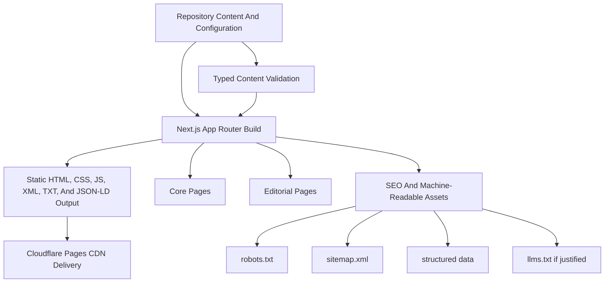

# ApneTailor Website Technical Architecture

## 1. Architecture Design


## 2. Technology Description
- Frontend framework: `Next.js` App Router
- Language: `TypeScript`
- Deployment target: `Cloudflare Pages`
- Rendering model: static export with meaningful pre-rendered HTML
- Styling approach: design-token-driven CSS architecture with a strong mobile-first system
- Content model: repository-based structured content files validated at build time
- Backend: none in V1
- Database: none in V1

Rationale:
- Matches the static-first business and deployment requirements
- Minimizes attack surface and operating cost
- Preserves strong SEO and accessibility through pre-rendered HTML
- Keeps future expansion possible without introducing unapproved infrastructure now

## 3. Build And Deployment Model
- Next.js configuration should use `output: 'export'`
- Local development command should use the normal Next.js dev workflow
- Production build command should be `npx next build`
- Static export output directory should be `out`
- Cloudflare Pages should use the `Next.js (Static HTML Export)` preset

Constraints of this model:
- No request-time rendering
- No Server Actions
- No request-dependent Route Handlers
- No runtime personalization
- No ISR
- Dynamic routes must be fully known at build time

## 4. Route Definitions
| Route | Purpose |
|-------|---------|
| `/` | Homepage and primary conversion entry point |
| `/how-it-works/` | Explain the customer journey and fabric flows |
| `/services/` | Supported services and garments hub |
| `/services/women/` | Women’s tailoring hub |
| `/services/men/` | Men’s tailoring hub |
| `/services/women/suit/` | Supported garment page |
| `/services/women/saree/` | Supported garment page |
| `/services/women/kurti/` | Supported garment page |
| `/services/women/lehenga/` | Supported garment page |
| `/services/women/blouse/` | Supported garment page |
| `/services/men/kurta/` | Supported garment page |
| `/services/men/formal-suit/` | Supported garment page |
| `/services/men/shirt/` | Supported garment page |
| `/services/men/sherwani/` | Supported garment page |
| `/services/men/pant/` | Supported garment page |
| `/about/` | Company and founders overview |
| `/contact/` | Public contact route |
| `/support/` | Support guidance and issue-routing information |
| `/faq/` | FAQ hub |
| `/blog/` | Editorial index |
| `/blog/[slug]/` | Question-led article page |
| `/editorial-team/` | Explain authorship model |
| `/editorial-policy/` | Editorial standards |
| `/review-policy/` | Review and correction standards |
| `/accessibility-statement/` | Accessibility commitment |
| `/security/` | Security-conscious trust page |
| `/media/` | Press and company information |
| `/privacy-policy/` | Preserved legal route |
| `/terms/` | Preserved legal route |
| `/data-compliance/` | Preserved legal route |
| `/delete-accounts/` | Preserved legal route |
| `/refund-and-cancellation-policy/` | Draft policy page pending approved business rules |
| `/pickup-and-delivery-policy/` | Draft policy page pending approved business rules |
| `/404` or `not-found` output | Custom not-found experience |

## 5. Proposed Project Structure
```text
app/
  (marketing)/
  blog/
  services/
  privacy-policy/
  terms/
  data-compliance/
  delete-accounts/
  sitemap.ts or build-generated sitemap utility
  robots.ts or build-generated robots utility

components/
  layout/
  navigation/
  sections/
  content/
  seo/
  ui/

content/
  site/
  services/
  faqs/
  blog/
  authors/
  policies/
  service-areas/

lib/
  config/
  content/
  seo/
  schema/
  validation/
  utils/

public/
  images/
  icons/

docs/
  project documentation files
```

## 6. Content And Configuration Model

### 6.1 Typed Public Configuration
Centralize mutable public business values in a typed site configuration:
- brand name
- tagline
- support email
- canonical domain
- founders
- app download URL state
- legal route map
- supported garments
- service-area data structure
- default metadata

### 6.2 Repository Content Types
| Content Type | Purpose | Validation Needs |
|--------------|---------|------------------|
| Site content | Shared copy blocks, trust statements, and footer data | Required strings and route correctness |
| Service content | Hubs and garment pages | Supported category validation and metadata |
| FAQ content | Centralized questions and answers | Topic grouping and duplicate prevention |
| Blog content | Question-led editorial pages | Required metadata, slug uniqueness, author validity |
| Author content | Editorial team page and future reviewers | Approved identities only |
| Policy content | Draft or final policy pages | Draft/final state and review requirements |
| Service-area content | Future approved public availability data | Conservative defaults and indexability flags |

### 6.3 Validation Approach
- Use schema validation at build time for content and config
- Fail builds on critical issues such as:
  - missing title or description
  - duplicate slugs
  - invalid canonical path
  - invalid author reference
  - unsupported garment reference
  - accidental indexability on placeholder or draft content

## 7. Rendering Strategy
- Default to Server Components compatible with static export
- Use Client Components only for genuine interaction such as mobile navigation or lightweight enhancement
- Keep page-level content renderable without client hydration
- Ensure all essential copy, headings, and links exist in pre-rendered HTML

## 8. SEO Architecture
- Central metadata utilities for title, description, canonical URL, Open Graph, and robots directives
- Consistent trailing-slash policy across routes
- Automated XML sitemap generation for canonical indexable pages only
- Build-time `robots.txt`
- Breadcrumb support on deeper navigational pages where it improves orientation
- Page-specific JSON-LD generation from validated content

Recommended schema types:
- `Organization`
- `WebSite`
- `BreadcrumbList`
- `Service`
- `Person`
- `Article` or `BlogPosting`
- `VideoObject` only where supported by real public media

Not allowed:
- fake reviews
- aggregate ratings
- fake pricing or offers
- fake local business locations

## 9. AI Discoverability Strategy
- Use the same source of truth for human-visible content and machine-readable outputs
- Keep entity information consistent across page copy, metadata, and JSON-LD
- Prefer question-led articles with direct answers near the top
- Consider `llms.txt` only as a supplemental file if the final implementation adds meaningful machine-readable value
- Do not create deceptive crawler-targeted content

## 10. Accessibility Architecture
- Semantic HTML and landmark structure by default
- Skip link in the global layout
- One clear primary H1 per page
- Visible focus states in the design token system
- Reduced-motion handling in global styles and enhanced components
- Accessible mobile navigation without hover dependence
- Legal and editorial pages optimized for long-form readability

## 11. Performance Architecture
- Mobile-first layout system
- Minimal JavaScript by default
- Small interactive islands only where needed
- No loading screen
- No heavy background video above the fold
- Optimized images with explicit dimensions and careful format choice
- Limited font families and weights
- Lazy-load noncritical media and decorative effects
- Avoid heavy third-party libraries unless they provide clear value

## 12. Security Architecture
- No secrets in code, config, or client bundles
- No custom backend endpoints in V1
- Safe rendering of repository content only
- No arbitrary HTML execution from untrusted input
- Security headers documented for Cloudflare Pages deployment
- Dependency review and lockfile enforcement
- Future server-side features must go through separate approval

Recommended deployment headers to document:
- `Content-Security-Policy`
- `Referrer-Policy`
- `Permissions-Policy`
- `X-Content-Type-Options`
- `Strict-Transport-Security`
- clickjacking protection through CSP `frame-ancestors`

## 13. Testing And Validation Strategy
High-value checks for this architecture:
- `TypeScript` typecheck
- linting
- production build
- content validation
- metadata validation
- sitemap and robots validation
- structured-data sanity checks
- broken internal-link checks
- accessibility smoke checks
- responsive review
- reduced-motion review

Tests should focus on:
- content and configuration correctness
- SEO-critical outputs
- structured-data integrity
- complex utility functions

## 14. Dependency Proposal
Initial expected dependencies:
- `next`
- `react`
- `react-dom`
- `typescript`
- `zod`

Conditionally justified:
- `tailwindcss` for scalable tokenized styling
- a lightweight content parser if plain TypeScript modules are too limiting for editorial workflows

Explicitly avoided for V1:
- CMS platforms
- backend frameworks
- database clients
- analytics SDKs
- heavy animation libraries unless later justified by measured value

## 15. Risks And Mitigations
| Risk | Impact | Mitigation |
|------|--------|------------|
| Runtime-only Next.js features slip into the build | Build or deploy failure on Cloudflare Pages | Keep architecture static-export-safe from day one |
| Unsupported business claims enter content | Trust and legal risk | Central review of policies, service areas, and guarantees |
| Content grows without structure | SEO and maintenance problems | Enforce typed schemas and repository conventions |
| Motion becomes too heavy | Performance and accessibility regression | CSS-first enhancement, profiling, and reduced-motion support |
| Legal routes drift from current meaning | Compliance risk | Preserve route paths and keep substantive meaning aligned with current public pages |

## 16. Implementation Sequence
1. Initialize static-export-safe Next.js foundation
2. Build typed configuration, content schemas, and metadata utilities
3. Create design tokens, layout shell, and global accessibility primitives
4. Implement homepage, navigation, footer, and core marketing pages
5. Integrate legal routes and draft policy pages
6. Add editorial system, blog routes, and initial seeded content
7. Add SEO outputs, schema, sitemap, robots, and optional `llms.txt` evaluation
8. Run validation, polish motion carefully, and prepare documentation
